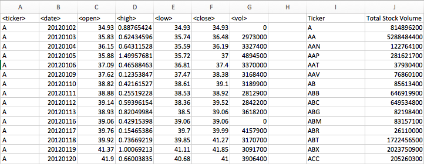

# Unit 2 | Assignment - The VBA of Wall Street

### Background

You are well on your way to becoming a programmer and Excel master! In this homework assignment you will use VBA scripting to analyze a year's worth of real stock market data.

### Stock market analyst

### Easy

* Create a script that will loop through each year of stock data and grab the total amount of volume each stock had over the year.

* You will also need to display the ticker symbol to coincide with the total volume.

* Your result should look as follows.

### Moderate

* Create a script that will loop through all the stocks and take the following info.

   * Yearly change from what the stock opened the year at to what the closing price was.

   * The percent change from the what it opened the year at to what it closed.

   * The total Volume of the stock

   * Ticker symbol

* You should also have conditional formatting that will highlight positive change in green and negative change in red.

* The result should look as follows.

### Hard

* Your solution will include everything from the moderate challenge.

* Your solution will also be able to locate the stock with the "Greatest % increase", "Greatest % Decrease" and "Greatest total volume".

* Solution will look as follows.

### BONUS

* Make the appropriate adjustments to your script that will allow it to run on every worksheet just by running it once.

* This can be applied to any of the difficulties.

### Other consideration.

* Test using the testing data set. These sheets are smaller and will allow you to test faster. 

* Make sure that the script acts the same on each sheet. The joy of VBA is take the tediousness out of repetitive task and run over and over again with a click of the button.

