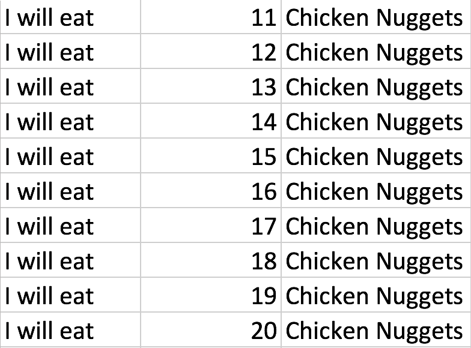

# Looping on through

Now it's your chance to see how quickly we can create things utilizing the power of a computer!

## Instructions

* Create a `For` loop that will produce the following example.

## Bonus

* If you finish earlier, start researching `Do While` and `Do Until` loops.
